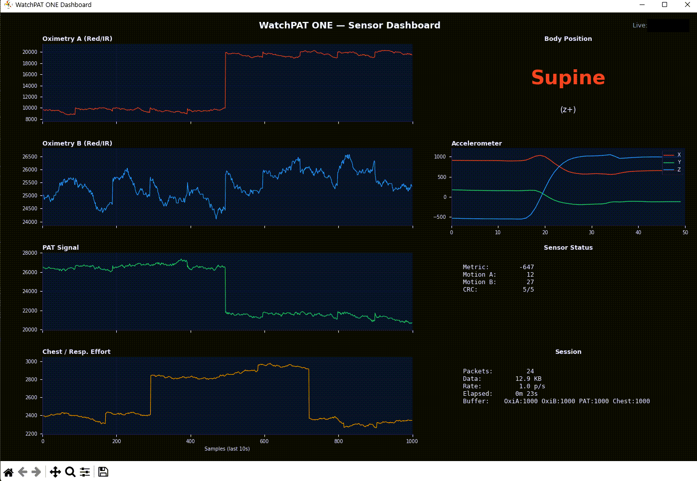

# WatchPAT ONE BLE Client

Open-source Python client for the **WatchPAT ONE** sleep diagnostics device by Itamar Medical / ZOLL. Connects over Bluetooth Low Energy, captures raw sensor data, decodes the binary protocol in real time, and visualizes waveforms in a live dashboard.

The BLE protocol and binary data format were reverse-engineered from the WatchPAT Android app (v4.2.0) and raw device captures.



## Features

- **BLE connection** via Nordic UART Service (NUS) with full packet reassembly and CRC validation
- **Device control** — session start, acquisition start/stop, BIT (Built-In Test), finger detection, LED control, tech status
- **Real-time data decoding** of all known sensor channels:
  - Oximetry A & B (red/IR, 100 Hz) — zigzag byte-delta compressed
  - PAT signal (100 Hz) — zigzag byte-delta compressed
  - Chest / respiratory effort (100 Hz) — nibble-delta compressed
  - Body position & accelerometer (5 Hz) — SBP chest sensor with CRC-verified subframes
  - Derived metric (1 Hz)
  - Event records
- **Live GUI dashboard** with rolling waveform plots, body position indicator, accelerometer view, and session stats
- **Raw capture** to length-prefixed `.dat` files for offline analysis
- **Offline replay** and **CSV export** of all decoded channels

## Requirements

- Python 3.10+
- [bleak](https://github.com/hbldh/bleak) — BLE client library
- [matplotlib](https://matplotlib.org/) — dashboard GUI
- [numpy](https://numpy.org/) — numerical arrays for plotting

```
pip install bleak matplotlib numpy
```

## Usage

### Scan for devices

```bash
python watchpat_ble.py --scan-only
```

### Connect and run diagnostics

```bash
# Built-In Test
python watchpat_ble.py --serial XXXXXXXXX --bit

# Technical status (battery, LEDs)
python watchpat_ble.py --serial XXXXXXXXX --tech-status

# Finger detection
python watchpat_ble.py --serial XXXXXXXXX --finger
```

### Live capture (CLI)

```bash
# Record with decoded status line
python watchpat_ble.py --serial XXXXXXXXX --monitor

# Record for 60 seconds to a specific file
python watchpat_ble.py --serial XXXXXXXXX --monitor --duration 60 -o capture.dat
```

### Live capture (GUI dashboard)

```bash
python watchpat_gui.py --serial XXXXXXXXX
```

### Replay and export

```bash
# Replay a capture file (text summary)
python watchpat_ble.py --replay capture.dat

# Export all channels to CSV
python watchpat_ble.py --replay capture.dat --csv output_prefix

# Replay with GUI dashboard
python watchpat_gui.py --replay capture.dat
python watchpat_gui.py --replay capture.dat --speed 10  # 10x speed
```

## Protocol Overview

### BLE Transport

The device uses the Nordic UART Service (NUS). Packets have a 24-byte header:

| Offset | Size | Field | Encoding |
|--------|------|-------|----------|
| 0 | 2 | Signature | `0xBBBB` big-endian |
| 2 | 2 | Opcode | big-endian |
| 4 | 8 | Timestamp | little-endian |
| 12 | 4 | Packet ID | little-endian |
| 16 | 2 | Total length | little-endian |
| 18 | 2 | Opcode-dependent | little-endian |
| 20 | 2 | Reserved | |
| 22 | 2 | CRC-16 | little-endian |

CRC-16 uses polynomial `0x1021` with init `0xFFFF` (CCITT variant).

### Data Packet Structure

Each `DATA_PACKET` (opcode `0x0800`) payload contains multiple logical records, each prefixed with a 12-byte header:

| Offset | Size | Field |
|--------|------|-------|
| 0 | 2 | Sync word `0xAAAA` |
| 2 | 1 | Record ID |
| 3 | 1 | Record type |
| 4 | 2 | Payload length (LE) |
| 6 | 2 | Sample rate (LE) |
| 8 | 4 | Flags (LE) |

### Sensor Channels

| Record ID/Type | Rate | Description | Codec |
|---------------|------|-------------|-------|
| `01/11` | 100 Hz | Oximetry channel A | 2-byte seed + zigzag8 deltas |
| `02/11` | 100 Hz | Oximetry channel B | 2-byte seed + zigzag8 deltas |
| `03/11` | 100 Hz | PAT waveform | 2-byte seed + zigzag8 deltas |
| `04/01` | 100 Hz | Chest / respiratory effort | 2-byte seed + nibble deltas |
| `05/10` | 1 Hz | Derived metric | 4-byte signed LE int |
| `06/00` | 5 Hz | SBP motion/orientation | 5x 16-byte CRC'd subframes |
| `0C/00` | rare | Event code | 2-byte LE value |
| `0D/00` | rare | Event payload | 20 raw bytes |

### Motion Subframe (06/00)

Each of the five 16-byte subframes:

```
dd dd a3 57   — fixed marker
field_a:u16le — chest motion summary
field_b:u16le — snore summary candidate
x:i16le       — accelerometer X
y:i16le       — accelerometer Y
z:i16le       — accelerometer Z
crc16:u16le   — CRC-16 over first 14 bytes
```

Body position is derived from dominant accelerometer axis (supine = z+, prone = z-, left = y+, right = y-, upright = x+).

## File Format

Capture `.dat` files use a simple length-prefixed format for easy replay:

```
[4-byte LE length][payload bytes][4-byte LE length][payload bytes]...
```

Each payload is one complete `DATA_PACKET` containing ~1 second of sensor data across all channels.

## Project Structure

| File | Description |
|------|-------------|
| `watchpat_ble.py` | BLE client, protocol implementation, data decoding, CLI |
| `watchpat_gui.py` | Real-time matplotlib dashboard |
| `watchpat.proto` | Protobuf schema for the binary data format |

## Disclaimer

This project is an independent reverse engineering effort for personal and educational use. It is not affiliated with, endorsed by, or supported by Itamar Medical, ZOLL, or any related entity. The WatchPAT ONE is a medical device — this software is not intended for clinical use. Use at your own risk.

## License

[MIT](LICENSE)
